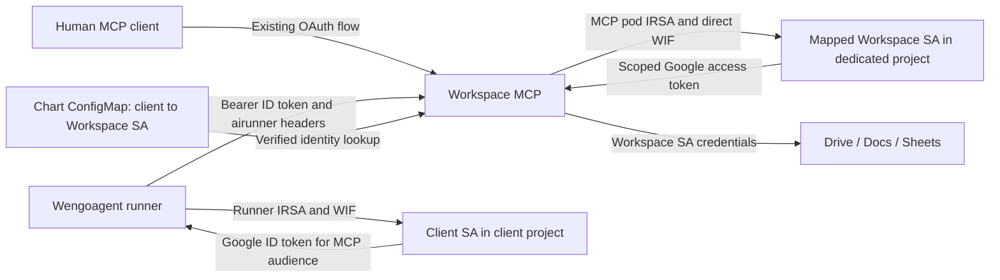

# Machine access: Google service accounts and airunner

Status: initial implementation, 2026-09-22. Machine access is disabled by default.
The operator has applied the dedicated GCP project, two Workspace service
accounts, and WIF resources. Live IRSA/WIF and Workspace API access still require
deployment validation with the new application image and chart.

## Authentication and identity mapping

The existing human OAuth 2.1 flow remains the human login and credential path.
Machine clients present Google-signed service-account ID JWTs. A chart-managed
ConfigMap maps the verified client `(issuer, sub)` to a dedicated Workspace
service account (SA), with an additional email check.

Client SAs, including Wengoagent identities in `mybestprouploads`, authenticate
to MCP. Workspace SAs live in a dedicated GCP project and hold the intended
Drive sharing. Several clients may share one Workspace SA, or use separate
Workspace SAs for different file access. Each client maps to one target.

There is no database for the mapping, broker, intermediate broker SA, downloaded
SA key, human impersonation, or domain-wide delegation. No automatic properties,
tags, comments, descriptions, or annotations are added to created or edited
files. Attribution is recorded in MCP logs only.



The incoming ID JWT is never used as a Google Workspace access token or stored
in a human OAuth session. The MCP's own AWS identity holds WIF grants on the
Workspace targets. The client SA needs no IAM grant in the dedicated project,
no Workspace API activation in its own project, and no permission to impersonate
the Workspace target. Runner-side grants to mint the client ID token remain
independent of MCP-side grants to mint Workspace access tokens.

Machine JWT verification pins Google's issuer, JWKS endpoint, and RS256. It
requires an exact endpoint audience, subject, expiry, issued-at time, matching
email, and `email_verified=true`. JWT target claims, tool email arguments, and
airunner headers cannot change the selected Workspace SA. A recreated SA with
the same email has a different numeric ID and needs a mapping update.

Each profile has a distinct audience. A token for a Docs profile does not work
on the full endpoint or another profile. Human provider objects, encrypted
storage, refresh recovery, callback behavior, and consent scopes are retained
behind the combined authentication layer.

## Runtime and chart configuration

The implementation uses these settings:

| Setting | Purpose |
| --- | --- |
| `MCP_MACHINE_ACCESS_ENABLED=true` | Enable machine access alongside built-in human OAuth 2.1. Defaults to false. |
| `MCP_MACHINE_POLICY_FILE` | Path to the JSON client/target policy. Required when enabled. |
| `MCP_MACHINE_WIF_FILE` | Path to the JSON WIF provider audience and AWS region. Required when enabled. |
| `MCP_ENABLE_OAUTH21=true` | Retain built-in human OAuth. Machine access rejects external-OAuth, DWD, and trusted-gateway modes. |

The chart's `machineAccess` values render `policy.json` and `wif.json` in a
ConfigMap mounted read-only at `/etc/workspace-mcp/machine-access`. The chart
sets the runtime variables and includes a configuration checksum in the pod
spec so changes trigger a rollout. These files contain no tokens or private
keys, but their write permissions control client authorization.

Use [the chart example](helm-chart/workspace-mcp/examples/machine-access.values.yaml)
as a starting point. This smaller example demonstrates two clients sharing a
target with different permissions; all IDs and URLs below are illustrative:

```yaml
machineAccess:
  enabled: false
  wif:
    audience: //iam.googleapis.com/projects/123456789012/locations/global/workloadIdentityPools/workspace-mcp/providers/aws-mcp
    aws_region: eu-west-3
  policy:
    schema_version: 1
    issuer: https://accounts.google.com
    api_consumer_project: wengo-workspace-mcp
    endpoints:
      full:
        audience: https://workspace-mcp.example.com/mcp
      docs:
        audience: https://docs-mcp.example.com/mcp
    workspace_accounts:
      editorial:
        email: workspace-editorial@wengo-workspace-mcp.iam.gserviceaccount.com
        unique_id: "223456789012345678901"
        creation_folder_id: SHARED_DRIVE_FOLDER_ID
    clients:
      wengoagent-prod:
        subject: "123456789012345678901"
        email: wengoagent-eks-paris-prod@mybestprouploads.iam.gserviceaccount.com
        workspace_account: editorial
        endpoints: [full, docs]
        services: [drive, docs, sheets]
        permissions: read-write
        scope_ceiling:
          - https://www.googleapis.com/auth/drive
          - https://www.googleapis.com/auth/drive.readonly
      editorial-exporter:
        subject: "123456789012345678902"
        email: editorial-exporter@client-project.iam.gserviceaccount.com
        workspace_account: editorial
        endpoints: [docs]
        services: [drive, docs]
        permissions: read-only
        scope_ceiling:
          - https://www.googleapis.com/auth/drive.readonly
```

Declare `full` even when only profiles are intended for machines; omit `full`
from client endpoint lists in that case. Other endpoint keys must match actual
`mcpProfiles` keys. Each audience must match that profile's complete public MCP
URL, including path. Profiles omitted from the machine policy remain human-only.

Policy loading rejects duplicate JSON keys, duplicate client subjects, missing
targets, unknown fields/services/scopes, and write scopes in read-only policies.
Subjects and target unique IDs are strings. Target emails must belong to the
configured dedicated project. Populate target email/ID pairs from Terraform
outputs; impersonation uses the numeric target ID, not a caller-supplied email.

The runtime loads one policy snapshot at startup. An out-of-band ConfigMap edit
does not reload running processes. Complete the chart rollout and drain old
replicas before treating a mapping removal as effective. Adding a client to an
existing target requires only a configuration update; adding a new target also
requires Terraform and Workspace file sharing.

## Keyless outgoing credentials and permissions

The credential path follows the existing Astroedito pattern:

```text
MCP Kubernetes SA: exploit/google-workspace-mcp-sa
  -> IRSA role: eksMcp-google-workspace-eks-paris-prod
  -> signed AWS STS GetCallerIdentity request
  -> Google STS exchange through the dedicated AWS WIF provider
  -> IAM Credentials generateAccessToken on the mapped Workspace SA unique ID
  -> scoped Workspace access token
```

The Kubernetes SA needs its `eks.amazonaws.com/role-arn` annotation. EKS IRSA
and the AWS SDK already rotate temporary AWS credentials. The Python supplier
only bridges Google auth to Boto3's native refreshable credential chain; it does
not introduce another IRSA refresh mechanism. Each exchange takes a fresh SDK
credential snapshot. Static AWS credentials and node-role metadata fallback are
rejected in this machine path.

The Google provider admits explicitly configured AWS role identities, stripping
STS session suffixes for role matching. IAM bindings use the STS assumed-role
form without the IAM path `/eks/exploit/`. Each target grants
`roles/iam.workloadIdentityUser` to the MCP role principal set. No additional
`roles/iam.serviceAccountTokenCreator` grant is needed.

Workspace SAs, WIF, and Drive/Docs/Sheets API activation all live in the dedicated
project. Credentials explicitly select that project with `quota_project_id`,
which adds `x-goog-user-project`. Terraform grants Service Usage consumption to
the target SAs and the federated MCP principals used during credential refresh.
This grants neither document access nor project administration.

Credentials are cached in memory by target unique ID and scope set within one
fixed policy/WIF/project configuration. The cache is bounded; refresh is
serialized, and each call builds a separate Google HTTP client. Client policy
is checked before cache access. Sharing cached credentials does not share audit
identity or authorization decisions. Neither human sessions nor Valkey are
used for machine credential persistence.

### Scope and tool enforcement

Supported services are Drive, Docs, and Sheets. Machine tools are derived from
the existing service decorators in those modules. Unknown tools, other service
modules, and `import_to_google_slides` are unavailable. Tool listing is filtered,
and tool execution independently enforces the policy. Machine prompt/resource
execution is disabled in this first implementation.

Read/write classification and service dependencies come from the decorators,
not caller hints. Multi-service operations check every dependency before starting.
For example, `insert_doc_image` needs write-capable Docs credentials and
read-capable Drive credentials. Creating a Doc or spreadsheet also needs Drive
write access because initial creation occurs through Drive.

`scope_ceiling` is a list of permitted scope choices, not a bundle requested
wholesale. Reads use read-only scopes, even for a read-write client. Include
both read and write choices when both are needed. Service-specific Docs/Sheets
scopes are preferred when configured; corresponding Drive scopes are accepted
alternatives. Drive metadata-only read scopes can serve metadata tools such as
search/list/permissions inspection, but cannot serve content downloads. The
first implementation uses full Drive scopes for Drive writes; it does not use
`drive.file` to claim access to every pre-existing shared file.

Google enforces the scopes in each minted token, and file ACLs still apply.
Scope grants are additive: full `drive` also permits Docs/Sheets content writes.
However, WIF/IAM delegation does not enforce the MCP's scope ceiling on the
minter. API activation and quota-project selection are not security boundaries
confining the SA to a project or API subset.

Keep Workspace SAs dedicated to intended files, with no unrelated Cloud roles
or rights to impersonate other SAs. A compromised MCP process can use the union
of permissions of all Workspace SAs its WIF identity may impersonate. The
ConfigMap controls normal client access; isolation from a compromised shared
backend would require separate deployments and workload identities.

### File access and creation

Share intended files, folders, or shared drives with the **Workspace SA**, not
merely the client SA. GCP IAM grants do not grant document access. Organization
external-sharing restrictions still apply, and domain-wide sharing does not
automatically include service accounts.

SAs cannot own files and have no personal Drive storage quota. Machine creation
uses shared-drive folders. A target's `creation_folder_id` supplies the default
for omitted/`root` destinations; an explicitly supplied shared-drive folder is
checked using Drive metadata. Folder shortcuts are resolved. The default is a
destination convenience, not a restriction on all reads or edits.

`create_doc` and `create_spreadsheet` create the native file through Drive first,
then use Docs/Sheets to initialize content or tabs. If initialization fails, the
error retains the new file ID and warns against creating another copy. Drive
uploads, imports, folders, copies, and PDF exports also check shared-drive
creation destinations. No provenance metadata is written.

Machine uploads accept inline content and HTTP(S) sources. Local file paths and
`file://` uploads are rejected so remote clients cannot upload pod files,
including workload credentials. Human/local behavior retains its existing rules.

## Airunner audit logging

Airunner support is implemented independently of the forthcoming Wengoagent
Codex header support. Read these headers on each machine tool call:

| Header | Field | Authority |
| --- | --- | --- |
| `x-airunner-identity` | `airunner.identity` | Caller-supplied runner/prototype label |
| `x-airunner-consumeraccount` | `airunner.consumer_account` | Caller-supplied consumer label |
| `x-airunner-job` | `airunner.job` | Caller-supplied job ID |
| Verified JWT issuer/subject/email | `principal.*` | Authenticated client SA |
| Resolved target | `google_service_account`, `google_service_account_unique_id` | Actual Workspace actor |
| Loaded mapping | `authorization.*` | Client/target keys and policy hash |

Missing headers are accepted and recorded as null. Values are limited to 1 KiB
of UTF-8 and reject control characters. They never authorize a request or select
a target. Multiple jobs using one client identity share its authorization;
labels do not establish per-consumer access boundaries.

The `workspace.audit` logger emits JSON lines to stderr, without the normal
console formatter. Events include policy load, rejected machine authentication,
Google API request outcomes, and machine tool-call summaries. Calls share a
server-generated event ID across their API records and final summary. Audit
records contain no bearer tokens, AWS credentials, document bodies, or complete
tool arguments.

Example tool-call summary:

```json
{
  "event": "workspace.machine.tool_call",
  "timestamp": "2026-09-22T10:00:00+00:00",
  "event_id": "SERVER_GENERATED_UUID",
  "profile": "docs",
  "tool": "batch_update_doc",
  "principal": {
    "kind": "machine_sa",
    "issuer": "https://accounts.google.com",
    "subject": "123456789012345678901",
    "email": "wengoagent-eks-paris-prod@mybestprouploads.iam.gserviceaccount.com"
  },
  "google_service_account": "workspace-editorial@wengo-workspace-mcp.iam.gserviceaccount.com",
  "google_service_account_unique_id": "223456789012345678901",
  "authorization": {
    "client_policy": "wengoagent-prod",
    "workspace_account": "editorial",
    "policy_version": "sha256:POLICY_HASH"
  },
  "airunner": {
    "identity": "report-writer@12",
    "consumer_account": "editorial",
    "job": "JOB_ID",
    "source": "caller_headers"
  },
  "outcome": "completed",
  "error_type": null,
  "duration_ms": 420,
  "file_ids": ["DOCUMENT_ID"],
  "api_request_count": 2
}
```

`completed` means the tool returned. Individual API records establish confirmed
Google operations. API errors remain recorded even when a tool catches them and
returns text. Summaries distinguish failures, denials, partial mutations, and
unknown write outcomes. Machine API writes disable automatic HTTP retries after
ambiguous failures. A logging failure must never cause content to be replayed.

File IDs come from API resource paths and known ID fields in mutation responses;
this is not an inventory of every file returned in searches. Streaming download
chunks that bypass `HttpRequest.execute` do not produce per-chunk API events;
the containing tool call is still audited. Deployment log collection and retention
must be checked during rollout. These logs cover MCP operations, not writes by
other clients.

Google controls native history attribution. Clients mapped to one Workspace SA
share that Google actor. Airunner/client attribution lives in MCP logs, with no
attempt to insert it into document history or content.

## Terraform and deployment handoff

Created configuration:

| Location | Contents |
| --- | --- |
| [GCP module](../terraform-infra/modules/gcp/google-workspace-mcp/main.tf) | Dedicated project, required APIs, a configurable map of Workspace SAs, WIF pool/provider, per-target grants, and Service Usage consumption. No private keys or DWD. |
| [GCP root wiring](../terraform-infra/google-workspace-mcp.tf) | Applied project `nifty-analyst-509412-n1` (number `91725077191`), separate `wengoagent-prod` and `wengoagent-preprod` targets, and trust for production MCP's existing AWS role. |
| [Module outputs](../terraform-infra/modules/gcp/google-workspace-mcp/outputs.tf) | Project ID/number, Workspace SA emails/unique IDs, and non-secret WIF configuration for the chart. |
| [Helm Terraform module](../terraform-helm/modules/google-workspace-mcp/release.tf) | Optional `machine_access` input, passed into chart values; enables the IRSA annotation when machine access is enabled. Defaults disabled. |
| [IRSA trust](../terraform-helm/modules/google-workspace-mcp/roleforsa.tf) | Existing namespace/Kubernetes-SA trust additionally requires the `sts.amazonaws.com` audience. |
| [Chart](helm-chart/workspace-mcp/Chart.yaml) | Version `0.3.1-wengo.3`, ConfigMap, mounts, runtime settings, and checksum rollout. |

The operator supplied the applied `google_workspace_mcp` outputs. Implementation
checks used local Terraform formatting and source checks; the coding agent did
not run init, reconfigure, validate, plan, apply, import, or deployment commands.

The production and preproduction clients map to separate Workspace identities:

| Client SA | Workspace SA in `nifty-analyst-509412-n1.iam.gserviceaccount.com` | Workspace numeric ID |
| --- | --- | --- |
| `wengoagent-eks-paris-prod@mybestprouploads.iam.gserviceaccount.com` | `workspace-wengoagent-prod` | `104876761360525072748` |
| `wengoagent-eks-preprod@mybestprouploads.iam.gserviceaccount.com` | `workspace-wengoagent-preprod` | `112747848092869179375` |

These numeric IDs identify the **Workspace targets**, not the client JWT
subjects. Obtain each client's numeric unique ID from IAM separately. The WIF
audience is
`//iam.googleapis.com/projects/91725077191/locations/global/workloadIdentityPools/workspace-mcp/providers/aws-mcp`,
with AWS region `eu-west-3`.

Operator sequence:

1. GCP provisioning is complete for the targets above. Future target or trust
   changes require operator validation, a reviewed plan, and apply in
   `terraform-infra`. The project has deletion protection.
2. Use the `google_workspace_mcp` output to populate `machineAccess.wif`,
   `policy.api_consumer_project`, and `policy.workspace_accounts`. Obtain each
   client SA's actual numeric unique ID from IAM, define the client mappings,
   and use the deployment's exact profile keys/public audiences.
3. Share the intended Workspace files/shared drives with the new Workspace SA
   emails. Set creation folder IDs to actual shared-drive folders. Terraform
   does not arrange Google Workspace sharing.
4. Build/publish an application image containing this change and publish/select
   chart `0.3.1-wengo.3`. In `terraform-helm`, set the module's `machine_access`
   input and chart/image versions, then run `terraform validate` and review
   `terraform plan` before applying. Do not enable the feature against an older
   image/chart. Confirm the rendered Kubernetes SA annotation and AWS trust.
5. Register Wengoagent with `token_type=gcp-sa-id-token`, the **client SA email**,
   and the matching MCP audience. The Workspace target stays internal to MCP.
   Codex may omit airunner headers until its independent integration is ready.
6. Pilot the machine path and human regression checks below before broad rollout.

Live acceptance checks still required:

- Human login, existing persisted sessions, refresh, and profile isolation across
  both replicas work with machine access enabled.
- Machine authentication succeeds only for mapped client identities and their
  exact endpoint audiences; disabled tools and read-only writes are rejected.
- IRSA, Google STS, and target access tokens renew after their first lifetime.
  There is no node-role fallback or ability to mint an unbound target token.
- Drive/Docs/Sheets use the dedicated project's Workspace identities and quota
  settings; client projects need no Workspace API activation or new IAM grants.
- Intended shared files are accessible, known unshared files are denied, and
  native Doc/Sheet creation succeeds directly in the chosen shared drive.
- Audit JSON reaches the log collector with both identities, policy version,
  airunner fields when supplied, partial outcomes, and file IDs.

Disable `machineAccess.enabled` to return to OAuth-only operation without
rotating human OAuth secrets. Removing one client's mapping affects that client
after all replicas roll. Revoking a shared target's WIF grant affects all its
clients and stops new token minting, but does not immediately invalidate
already-issued Google access tokens. Drive ACL removal controls actual file
access. Runner ID tokens expire independently and need runner-side renewal for
long jobs.

## Implementation and references

- [JWT composition](auth/machine_auth.py), [static policy](auth/machine_policy.py),
  [IRSA/WIF credentials](auth/machine_credentials.py), [MCP/API audit](auth/machine_audit.py)
- [Human/provider routing](core/tool_profiles.py), [credential selection](auth/service_decorator.py)
- [Astroedito WIF](../terraform-infra/modules/gcp/astroedito/wif.tf),
  [existing client SAs](../terraform-infra/modules/gcp/mybestprouploads/main.tf)
- [Google WIF for AWS](https://cloud.google.com/iam/docs/workload-identity-federation-with-other-clouds)
- [IAM Credentials generateAccessToken](https://cloud.google.com/iam/docs/reference/credentials/rest/v1/projects.serviceAccounts/generateAccessToken)
- [Quota-project selection](https://docs.cloud.google.com/docs/quotas/quota-project)
- [Python AWS credential suppliers](https://google-auth.readthedocs.io/en/latest/reference/google.auth.aws.html)
- [Drive SA storage restrictions](https://developers.google.com/workspace/drive/api/guides/handle-errors#storageQuotaExceeded)
