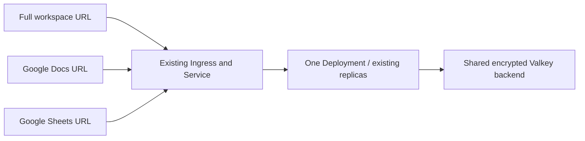

# Specialized MCP URLs with one deployment

Tool profiles expose fixed subsets of the loaded Google Workspace tools on
different hostnames. One Python process and one HTTP port serve all profiles.
The original URL continues to serve the full configured tool set.



## Configuration

Profiles require streamable HTTP and the built-in Google OAuth 2.1 provider
(`MCP_ENABLE_OAUTH21=true`, `EXTERNAL_OAUTH21_PROVIDER=false`). Use the existing
stateless HTTP and shared Valkey configuration for multiple replicas.

With Helm:

```yaml
mcpProfiles:
  gdocs:
    name: Google Docs
    url: https://google-workspace-gdocs-mcp.wengo.com/mcp
    services: [docs]
    tools: [search_drive_files, get_drive_shareable_link, import_to_google_doc]
  spreadsheets:
    name: Google Sheets
    url: https://google-workspace-spreadsheets-mcp.wengo.com/mcp
    services: [sheets]
    tools: [search_drive_files, get_drive_shareable_link, import_to_google_sheets]
```

Without Helm, set `WORKSPACE_MCP_TOOL_PROFILES` to the JSON equivalent of the
`mcpProfiles` map. Do not set both the chart value and the environment variable.

| Setting | Meaning |
| --- | --- |
| Profile key, e.g. `gdocs` | Stable storage namespace; lowercase letters, digits, `_` and `-` |
| `url` | Public HTTPS MCP endpoint, on a unique hostname; defaults to `/mcp` when the path is omitted |
| `name` | Optional name advertised during MCP initialization and OAuth consent |
| `services` | Optional service groups from `core/tool_tiers.yaml`, e.g. `docs`, `sheets`, `gmail` |
| `tier` | `core`, `extended`, or `complete` (default); tiers are cumulative |
| `tools` | Optional additional exact tool names; can also define an entire profile without `services` |

At least one service or explicit tool is required. Profiles operate on tools
already loaded by `--tools`, tiers, permissions, read-only mode, and the block
list. They cannot restore globally disabled tools. Invalid names, empty profiles,
or explicitly requested tools unavailable under global settings fail startup.
Service groups use the existing tier catalog, so developer/debug tools omitted
from that catalog are not automatically included.

Each profile registers only its selected tools. A client cannot call a tool
outside that profile even if it knows the name. The tool functions and imported
Google libraries are shared; this does not create extra containers or processes.

## Routing and OAuth

Add every profile hostname to the existing ingress, DNS, TLS, and any public
reverse proxy. Route `/` to the same Service and preserve the original `Host`
header. OAuth endpoints and discovery live alongside `/mcp` on each hostname.
`X-Forwarded-Host` is not used to choose a profile.

Register each new hostname's `/oauth2callback` URL in the existing Google OAuth
client (or the configured `GOOGLE_OAUTH_REDIRECT_URI` path, if customized). For
the example above:

- `https://google-workspace-gdocs-mcp.wengo.com/oauth2callback`
- `https://google-workspace-spreadsheets-mcp.wengo.com/oauth2callback`

FastMCP binds each profile's tokens to that profile's issuer and MCP URL. Tokens
from Docs are rejected by Sheets and by the full endpoint. Each profile uses
`profile_<key>` collection prefixes inside the existing encrypted storage. The
full endpoint's prefix, keys and audience are unchanged. Keep profile keys stable
to preserve registrations and refresh tokens across replicas and restarts.

The Google client ID/secret, encryption key, storage connection and configured
Google consent scopes are shared. Profiles reduce the tools an agent can use;
they do not independently reduce the Google scopes requested at consent.
Each new MCP connector has its own OAuth authorization flow. The current full
connector keeps its existing registrations and tokens.

With profiles enabled, the full endpoint is routed on the configured public and
internal base hostnames; unknown hosts return 404. `/health` remains available
on any host for Kubernetes probes. Without profiles, existing routing is unchanged.
An alternative single-segment MCP path such as `/com` is supported, with matching
OAuth resource metadata. Profiles on different paths of the same hostname are
not supported by this configuration.

## Client setup and release

Create separate MCP connector entries using the specialized URLs. Select the
relevant connector for each agent; attaching the full connector and all profiles
to the same agent would restore the large combined tool inventory.

The `../terraform-helm/modules/google-workspace-mcp` module contains the prepared
Wengo ingress/profile configuration and a rollout document with LibreChat snippets.
Publish a new application image and chart before promoting those settings;
older images ignore the new environment variable. Google callback registration
and public DNS/TLS routing must also be in place before users connect.
